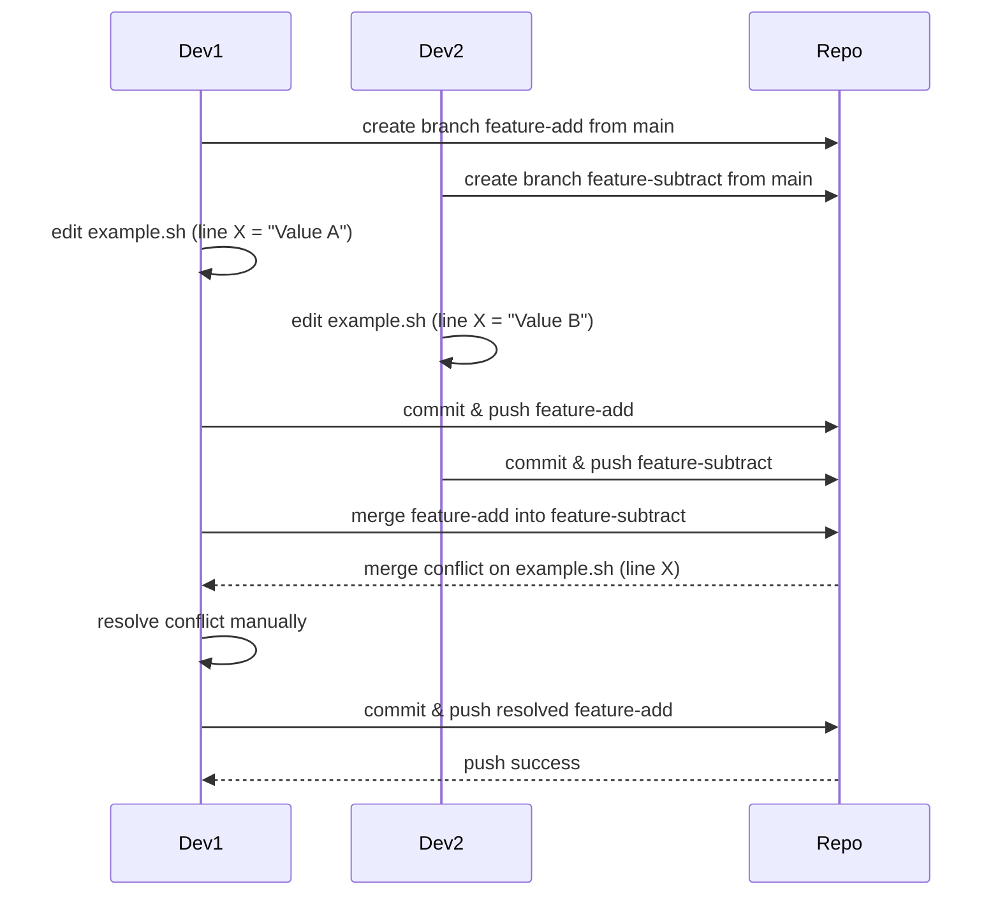

# Merge Conflict Diagram

```mermaid

  

sequenceDiagram

participant Dev1

participant Dev2

participant Repo

  

Dev1->>Repo: create branch feature-add from main

Dev2->>Repo: create branch feature-subtract from main

  

Dev1->>Dev1: edit example.sh (line X = "Value A")

Dev2->>Dev2: edit example.sh (line X = "Value B")

  

Dev1->>Repo: commit & push feature-add

Dev2->>Repo: commit & push feature-subtract

  

Dev1->>Repo: merge feature-add into feature-subtract

Repo-->>Dev1: merge conflict on example.sh (line X)

  

Dev1->>Dev1: resolve conflict manually

Dev1->>Repo: commit & push resolved feature-add

Repo-->>Dev1: push success

  

```