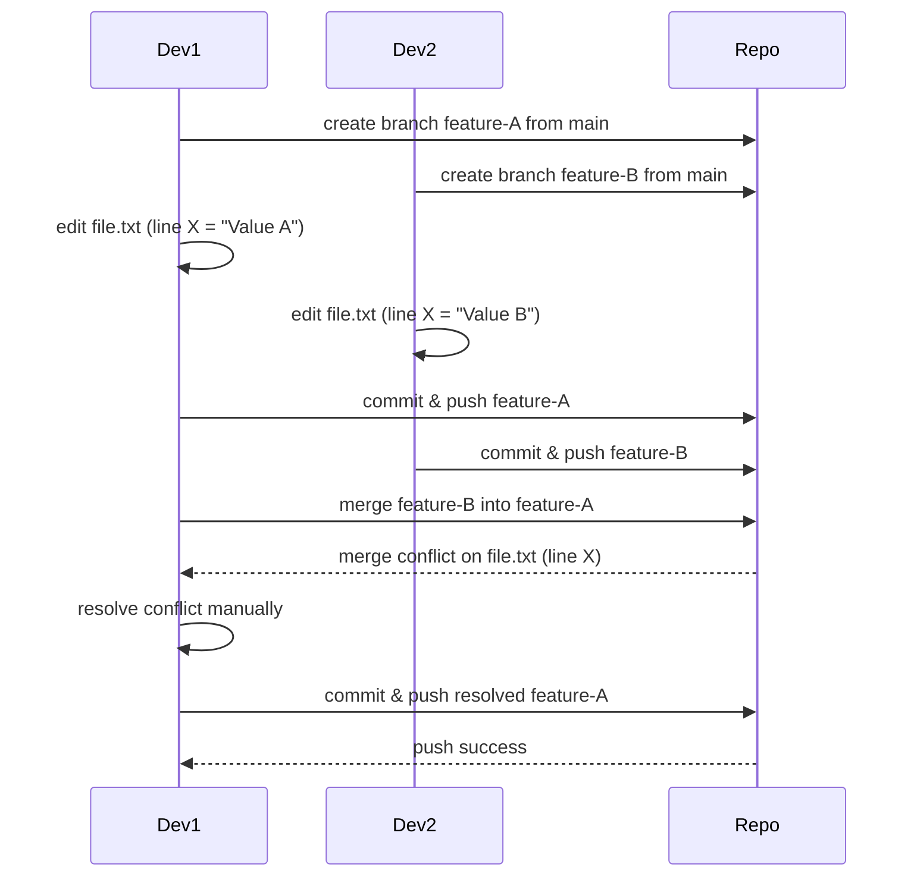

# Merge Conflict Diagram

```mermaid

  

sequenceDiagram

participant Dev1

participant Dev2

participant Repo

  

Dev1->>Repo: create branch feature-A from main

Dev2->>Repo: create branch feature-B from main

  

Dev1->>Dev1: edit file.txt (line X = "Value A")

Dev2->>Dev2: edit file.txt (line X = "Value B")

  

Dev1->>Repo: commit & push feature-A

Dev2->>Repo: commit & push feature-B

  

Dev1->>Repo: merge feature-B into feature-A

Repo-->>Dev1: merge conflict on file.txt (line X)

  

Dev1->>Dev1: resolve conflict manually

Dev1->>Repo: commit & push resolved feature-A

Repo-->>Dev1: push success

  

```

